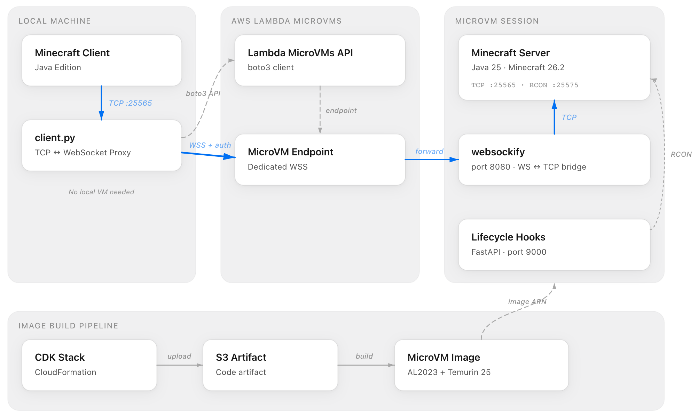

# ⛏️ microvm-minecraft ⛏️

An experimental project for hosting a Minecraft server (Java Edition) on AWS Lambda MicroVMs.

Instead of running always-on infrastructure like EC2 or ECS, this project leverages the on-demand nature of Lambda MicroVMs — boot only when you play, suspend when idle — to achieve a serverless Minecraft server.

## 🤔 How it works?

<br>

<div align="center">
  
</div>

<br>

Minecraft speaks plain TCP, but Lambda MicroVM endpoints only accept WebSocket (WSS) connections. So a TCP ⇔ WebSocket bridge sits on both ends:

1. **Local side** — `apps/client.py` listens on `127.0.0.1:25565` for TCP and forwards the stream to the MicroVM endpoint over WebSocket. The auth token and target port are passed as WebSocket subprotocols (`lambda-microvms.authentication.*` / `lambda-microvms.port.*`). The Minecraft client simply connects to `localhost:25565`.
2. **MicroVM side** — `websockify` accepts WebSocket connections on port 8080 and pipes them as TCP into the local Minecraft server (25565).
3. **Lifecycle management** — `apps/microvm/hook.py` (FastAPI, port 9000) handles Lambda MicroVMs lifecycle hooks: it launches the Minecraft server on `run`, and issues `save-all` via RCON on `suspend` / `terminate` to protect the world data.

Thanks to the idle policy set at `run_microvm` time, the MicroVM automatically suspends after 10 minutes of inactivity and resumes when a connection arrives (up to 8 hours of total runtime).

## 🗂️ Repository layout

```
microvm-minecraft
├── apps/
│   ├── client.py            # Local TCP ⇔ WebSocket proxy + MicroVM management CLI
│   └── microvm/
│       ├── entrypoint.sh    # Starts websockify and the hook server
│       ├── hook.py          # Lifecycle hooks (FastAPI)
│       └── fetch_jar.py     # Fetches server.jar at build time, sets up eula/rcon
├── cdk/                     # CDK stack defining the MicroVM image
├── Dockerfile               # MicroVM image build definition (Temurin 25 + rcon-cli + mc-monitor)
├── Makefile                 # Artifact assembly and deployment
└── docs/architecture.png
```

## ⚙️ Prerequisites

- Python 3.14+ and [uv](https://docs.astral.sh/uv/)
- AWS CDK CLI
- An AWS account with access to Lambda MicroVMs, plus credentials
- Minecraft Java Edition client

## 🧑‍💻 Setup

Install dependencies:

```sh
uv sync
```

Build and deploy the MicroVM image. `make build` gathers the Dockerfile and scripts into `artifact/` as an S3 asset, and CDK builds the image as an `AWS::Lambda::MicrovmImage`:

```sh
make deploy
```

Once the deployment completes, note the ARN of the created MicroVM image.

## ⚡️ Usage

### Host a server

```sh
uv run apps/client.py --image-arn <MicroVM image ARN>
```

When the MicroVM reaches `RUNNING`, the proxy starts listening on `127.0.0.1:25565`. Open Minecraft, go to Multiplayer, and connect to `localhost`.

Terminating the host process (Ctrl+C) also terminates the MicroVM.

### Join an existing server

Ask the host for the MicroVM ID, then connect from another account or machine:

```sh
uv run apps/client.py --microvm-id <MicroVM ID>
```

Guests are not the owner, so disconnecting does not shut down the MicroVM.

### Options

| Option | Default | Description |
| --- | --- | --- |
| `--image-arn` | — | Image ARN for launching a new MicroVM |
| `--microvm-id` | — | ID of an existing MicroVM to connect to (one of the two is required) |
| `--region` | `ap-northeast-1` | AWS region |
| `--port`, `-p` | `25565` | Local listen port |
| `--listen`, `-l` | `127.0.0.1` | Local listen address |

## 📝 Notes

- The Minecraft version is set via `MINECRAFT_VERSION` in the Dockerfile (currently 26.2), and the memory allocation via `-Xmx2G` in `hook.py`.
- Auth tokens expire after 60 minutes. Restart `client.py` when the token expires.
